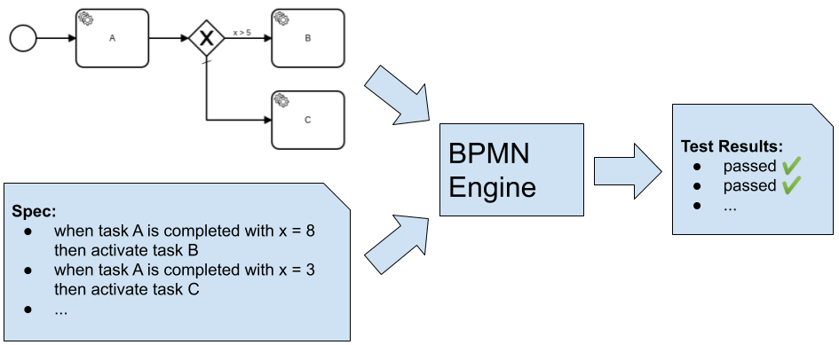
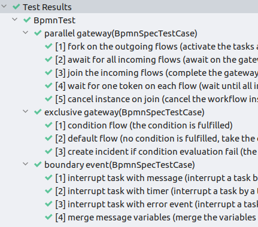

# BPMN Spec

A tool to write tests for BPMN workflows.  



**Features** :sparkles:

* business-friendly: the test spec is written in a text format, no coding is required
* vendor independent: the tests can run on any BPMN engine

Available integrations:

| Workflow Engine | Test Runner Dependency |
| --- | ---|
| [Zeebe](https://github.com/zeebe-io/zeebe)  | `<artifactId>zeebe-test-runner</artifactId>` | 

## Usage

Example spec with one test case:


*YAML Spec*
```yaml
resources:
  - exclusive-gateway.bpmn

testCases:
  - name: fulfill-condition
    description: should fulfill the condition and enter the upper task
    actions:
      - action: create-instance
        args:
          bpmn_process_id: exclusive-gateway
      - action: complete-task
        args:
          job_type: a
          variables: '{"x":8}'

    verifications:
      - verification: element-instance-state
        args:
          element_name: B
          state: activated
``` 

_More examples can be found here: https://github.com/zeebe-io/bpmn-tck_

*Kotlin Spec*
```kotlin
val testSpecFulfillCondition =
        testSpec {
            resources("exclusive-gateway.bpmn")

            testCase(name = "fulfill-condition", description = "should fulfill the condition and enter the upper task") {
                actions {
                    createInstance(bpmnProcessId = "exclusive-gateway")
                    completeTask(jobType = "a", variables = mapOf("x" to 8))
                }
                verifications {
                    elementInstanceState(selector = byName("B"), state = ElementInstanceState.ACTIVATED )
                }
            }
        };
```


### The Spec

A spec is written in a YAML text format, or alternative in Kotlin code. It contains the following elements:

* `resources`: a list of BPMN files that are used in test cases
* `testCases`: a list of test cases, each test case contains the following elements
  * `name`: the (short) name of the test case
  * `description`: (optional) an additional description of the test case
  * `actions`: a list of actions that are applied in order
  * `verifications`: a list of verifications that are checked in order after all actions are applied

### Actions

Actions drive the test case forward until the result is checked using the verifications. The following actions are available:

### create-instance

Create a new instance of a workflow.

* `bpmn_process_id`: the BPMN process id of the workflow
* `variables`: (optional) initial variables/payload to create the instance with
* `workflow_instance_alias`: (optional) an alias that can be used in following actions and verifications to reference this instance. This can be useful if multiple instances are created.
```
      - action: create-instance
        args:
          bpmn_process_id: demo
          variables: '{"x":1}'
```

### complete-task

Complete tasks of a given type.

* `job_type`: the type or identifier of the job/task
* `variables`: (optional) variables/payload to complete the tasks with
```
      - action: complete-task
        args:
          job_type: a
          variables: '{"y":2}'
```

### throw-error

Throw error events for tasks of a given type.

* `job_type`: the type or identifier of the job/task
* `error_code`: the error code that is used to correlate the error to an catch event
* `error_message`: (optional) an additional message of the error event  
```
      - action: throw-error
        args:
          job_type: b
          error_code: error-1
```

### publish-message

Publish a new message event.

* `message_name`: the name of the message
* `correlation_key`: the key that is used to correlate the message to a workflow instance
* `variables`: (optional) variables/payload to publish the message with
```
      - action: publish-message
        args:
          message_name: message-1
          correlation_key: key-1
          variables: '{"z":3}'
```

### cancel-instance

Cancel/terminate a workflow instance.

* `workflow_instance`: (optional) the alias of a workflow instance that is canceled. The alias is defined in the `create-instance` action. If only one instance is created then the alias is not required.
```
      - action: cancel-instance
        args:
          workflow_instance: wf-1
```

### await-element-instance-state

Await until an element of the workflow instance is in the given state.

* `state`: the state of the element to wait for. Must be one of: `activated | completed | terminated | taken` 
* `element_name`: (optional) the name of the element in the workflow
* `element_id`: (optional) as an alternative to the name, the element can be identified by its id in the workflow
* `workflow_instance`: (optional) the alias of a workflow instance. The alias is defined in the `create-instance` action. If only one instance is created then the alias is not required.
```
      - action: await-element-instance-state
        args:
          element_name: B
          state: activated
```

### Verifications

Verifications check the result of the test case after all actions are applied. The following verifications are available:

### workflow-instance-state

Check if the workflow instance is in a given state.

* `state`: the state of the workflow instance. Must be one of: `activated | completed | terminated` 
* `workflow_instance`: (optional) the alias of a workflow instance. The alias is defined in the `create-instance` action. If only one instance is created then the alias is not required.
```
      - verification: workflow-instance-state
        args:
          state: completed
```

### element-instance-state

Check if an element of the workflow instance is in a given state.

* `state`: the state of the element. Must be one of: `activated | completed | terminated | taken` 
* `element_name`: (optional) the name of the element in the workflow
* `element_id`: (optional) as an alternative to the name, the element can be identified by its id in the workflow
* `workflow_instance`: (optional) the alias of a workflow instance. The alias is defined in the `create-instance` action. If only one instance is created then the alias is not required.
```
      - verification: element-instance-state
        args:
          element_name: B
          state: activated
```

### workflow-instance-variable

Check if the workflow instance has a variable with the given name and value. If the element name or id is set then it checks only for (local) variables in the scope of the element.

* `name`: the name of the variable
* `value`: the value of the variable
* `element_name`: (optional) the name of the element in the workflow that has the variable in its scope
* `element_id`: (optional) as an alternative to the name, the element can be identified by its id in the workflow
* `workflow_instance`: (optional) the alias of a workflow instance. The alias is defined in the `create-instance` action. If only one instance is created then the alias is not required.
```
      - verification: workflow-instance-variable
        args:
          name: x
          value: '1'
```

### no-workflow-instance-variable

Check if the workflow instance has no variable with the given name. If the element name or id is set then it checks only for (local) variables in the scope of the element.

* `name`: the name of the variable
* `element_name`: (optional) the name of the element in the workflow that has the variable in its scope
* `element_id`: (optional) as an alternative to the name, the element can be identified by its id in the workflow
* `workflow_instance`: (optional) the alias of a workflow instance. The alias is defined in the `create-instance` action. If only one instance is created then the alias is not required.
```
      - verification: no-workflow-instance-variable
        args:
          name: y
          element_name: B
```

### incident-state

Check if the workflow instance has an incident in the given state. If the element name or id is set then it checks only for incidents in the scope of the element.

* `state`: the state of the incident. Must be one of: `created | resolved` 
* `errorType`: the type/classifier of the incident
* `errorMessage`: (optional) the error message of the incident
* `element_name`: (optional) the name of the element in the workflow that has the incident in its scope
* `element_id`: (optional) as an alternative to the name, the element can be identified by its id in the workflow
* `workflow_instance`: (optional) the alias of a workflow instance. The alias is defined in the `create-instance` action. If only one instance is created then the alias is not required.
```
      - verification: incident-state
        args:
          error_type: EXTRACT_VALUE_ERROR
          error_message: "failed to evaluate expression 'key': no variable found for name 'key'"
          state: created
          element_name: B
```

## Install

The tests can be run by calling the [SpecRunner](/core/src/main/kotlin/io/zeebe/bpmnspec/SpecRunner.kt) directly in code, or by using the JUnit integration. 

### JUnit Integration (generic)

1) Add the Maven dependencies:

```
<dependency>
  <groupId>io.zeebe.bpmn-spec</groupId>
  <artifactId>junit-extension</artifactId>
  <version>${bpmn-spec.version}</version>
  <scope>test</scope>
</dependency>

<!-- running the spec with [engine] -->
<dependency>
 // test runner implementation for [engine]
</dependency>
```    

2) Put the spec and BPMN files in the resource folder (e.g. `/src/test/resources/`)

3) Write a JUnit test class like the following (here in Kotlin):

```
package io.zeebe.bpmn.tck

import io.zeebe.bpmnspec.junit.BpmnSpecRunner
import io.zeebe.bpmnspec.junit.BpmnSpecSource
import io.zeebe.bpmnspec.junit.BpmnSpecTestCase
import io.zeebe.bpmnspec.junit.SpecRunnerFactory
import io.zeebe.bpmnspec.runner.zeebe.ZeebeTestRunner
import org.assertj.core.api.Assertions
import org.junit.jupiter.params.ParameterizedTest

@BpmnSpecRunner
class BpmnTest(factory: SpecRunnerFactory) {

    private val specRunner = factory.create(testRunner = MyEngineTestRunner())

    @ParameterizedTest
    @BpmnSpecSource(specResources = ["exclusive-gateway-spec.yaml"])
    fun `exclusive gateway`(spec: BpmnSpecTestCase) {

        val testResult = specRunner.runSingleTestCase(resources = spec.resources, testcase = spec.testCase)

        Assertions.assertThat(testResult.success)
                .describedAs("%s%nDetails: %s", testResult.message, testResult.output)
                .isTrue()
    }

}
```

* annotate the class with `@BpmnSpecRunner` 
* create an instance of the `SpecRunner` with the test runner that corresponds to the engine you want to test
  * the `SpecRunnerFactory` can be injected in the constructor, a `beforeEach`/`beforeAll` method, or the test method
* annotate the test method with `@ParameterizedTest` and `@BpmnSpecSource`
  * the parameter `specResources` lists the spec files to run 
  * add a method parameter of the type `BpmnSpecTestCase` that holds the resources and the parsed spec
* run the test cases in the test method using `SpecRunner.runSingleTestCase()` and pass the parameter `BpmnSpecTestCase` in it
* verify the test results with the return value

4) Run the JUnit test class




### JUnit Integration (ZeebeTestRunner)

This repository contains an integration for JUnit 5 using the extension API. To run the BPMN tests against Zeebe:  

1) Add the Maven dependency for the Zeebe test runner:

```
<!-- running the spec with Zeebe -->
<dependency>
  <groupId>io.zeebe.bpmn-spec</groupId>
  <artifactId>zeebe-test-runner</artifactId>
  <version>${bpmn-spec.version}</version>
  <scope>test</scope>
</dependency>
```    

2) Optionally, specify the image of Zeebe (with enabled Hazelcast exporter) to use for the tests. (if system properties are not set, then defaults will be used)
```
<project>
  [...]
  <build>
    <plugins>
      <plugin>
        <groupId>org.apache.maven.plugins</groupId>
        <artifactId>maven-surefire-plugin</artifactId>
        <configuration>
          <systemPropertyVariables>
            <zeebeImage>camunda/zeebe-with-hazelcast-exporter</zeebeImage>
            <zeebeImageVersion>0.24.2-0.10.0-alpha1</zeebeImageVersion>
          </systemPropertyVariables>
        </configuration>
      </plugin>
    </plugins>
  </build>
  [...]
</project>
```
3) Write a JUnit test class like the one mentioned above and use this line to select the `ZeebeTestRunner`:

```
private val specRunner = factory.create(testRunner = ZeebeTestRunner())
```

4) Follow the other steps as mentioned [above](#junit-integration-generic)